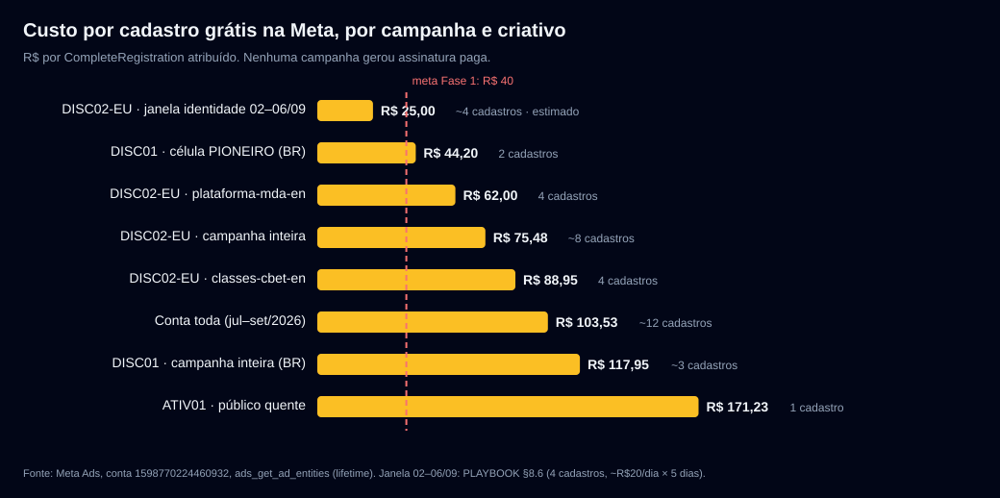
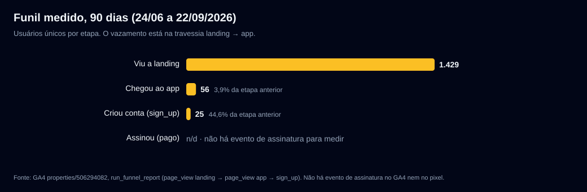

# 01 · Linha de base medida (22/09/2026)

Tudo aqui foi lido nesta sessão, só leitura, com a fonte de cada número. Nenhum número foi estimado,
salvo onde está escrito "estimado". Nenhum dado pessoal (e-mail, nome, id de usuário) entra neste doc.

## 1. Resumo em seis linhas

1. **Mídia paga na Meta, vida inteira da conta:** R$ 1.771,48 em 7 campanhas, ~12 cadastros grátis atribuídos, **zero assinatura paga**.
2. **Custo por cadastro:** R$ 103,53 na média da conta (jul–set); o melhor recorte foi a janela de identidade da DISC02-EU (02–06/09), ~R$ 25, e foi abandonado com 5 dias de vida.
3. **Funil do site (GA4, 90 dias):** 1.429 viram a landing → 56 chegaram ao app (3,9%) → 25 criaram conta (44,6% de quem chegou). O vazamento é a travessia landing → app, não o formulário.
4. **Atribuição:** a landing preserva a UTM em 93,9% das sessões; o app perde 65,1% para `(direct)`. Medido ao vivo hoje: **o botão "Comece grátis" da landing não repassa `utm_*` nem `fbclid` para o app** — só `mc=1` e o `_gl` do GA4. Por isso a UTM chega nula ao `tbl_user` e o `fbc` cobre só 7,7% dos eventos do pixel.
5. **Base e receita:** 267 contas, 52 grátis ativas, 14 pagantes, MRR R$ 1.260,17 (report diário, última execução 10/09); 2 a 8 cadastros por semana.
6. **O que não existe para medir:** evento de assinatura (`Purchase`/`Subscribe`) no pixel e no GA4; conversão grátis→pago por coorte; churn; receita Stripe (não autenticado nesta sessão).

## 2. Meta Ads — conta `1598770224460932` (BRL)

Fonte: `ads_get_ad_entities`, janela `maximum`. Detalhe completo das chamadas no relatório bruto do agente (não versionado, só leitura).

| Campanha | Objetivo | Gasto | CTR | Custo/LPV | Cadastros | Custo/cadastro |
|---|---|---:|---:|---:|---:|---:|
| Apresentando a Aura - 2026 (jan) | Tráfego → visita ao perfil | R$ 505,03 | 2,11% | n/d | 0 | n/d |
| Video Preflop Youtube (fev) | Tráfego | R$ 19,77 | **12,85%** | R$ 1,16 | 0 | n/d |
| Apresentando a Aura - Engajamento (fev) | Engajamento | R$ 4,38 | 0,56% | n/d | 0 | n/d |
| AURA-DISC01 · descoberta (BR, jul–ago) | Engajamento, 4 células | R$ 353,86 | 1,23% | R$ 0,95 | ~3 | R$ 117,95 |
| AURA-DISC02 · identidade (BR, ago) | Tráfego | R$ 113,41 | 2,81% | R$ 1,25 | 0 | n/d |
| AURA-ATIV01 · público quente (ago) | Engajamento | R$ 171,23 | 0,81% | R$ 2,56 | 1 | R$ 171,23 |
| AURA-DISC02-EU · leads (ago–set) | Leads, otim. cadastro | R$ 603,80 | 1,47% | R$ 7,02 | ~8 | R$ 75,48 |
| **Total** | | **R$ 1.771,48** | | | **~12** | **R$ 103,53** (sobre os R$ 1.243,60 com tracking de cadastro ativo) |

**Os quatro achados que o plano usa:**

- **O único recorte que produziu a preço aceitável foi identidade EN** (PokerStars + Professional Poker Player, 11 países da Europa, R$ 20/dia): 4 cadastros em 5 dias, 9,5 visitas por mil impressões (`PLAYBOOK-midia-paga-do-zero.md §8.6`, no checkout `aura-main/aura-marketing`, ainda sem push). Foi trocado por "amplo" e depois por interesse "Poker" isolado, e a campanha morreu em zero. A Fase 1 reabre exatamente esse recorte e **não mexe nele antes do gate**.
- **Criativo de plataforma venceu criativo de stat no público frio EU:** `disc02-plataforma-mda-en` R$ 62/cadastro e R$ 1,95/ThruPlay contra `disc03-classes-cbet-en` R$ 88,95 e R$ 7,26. No BR, a célula PIONEIRO ("isso não existia") foi a única com mais de um cadastro (R$ 44,20). Novidade de categoria converte melhor que stat solto. O overlay é novidade de categoria.
- **CPM Europa tier-1 ≈ R$ 35–48; BR histórico ≈ R$ 4–10.** O BR é 5 a 10 vezes mais barato, mas o pool de interesse "poker" no IG BR é o ecossistema de bets (`plano-fuga-das-bets.md`: 0,11–0,18 s por sessão, spam de "grupo VIP" nos comentários).
- **Pixel vivo, CAPI disparando, zero `Purchase`.** EMQ do `PageView` 6,1/10; `fbc` em 7,7%; nenhuma conversão personalizada. A Meta classifica a conta como "Publishing / Online Only Publications", não como software.

Divergência registrada, não resolvida: a DISC02-EU está `ACTIVE` como campanha, com o único ad set que gastou em `PAUSED`. Não há entrega. O log de atividade ainda não está liberado para a conta, então a data exata da pausa não foi confirmada por ferramenta; o commit `dd5f7ec` (15/09) registra a pausa.

## 3. GA4 — propriedade `506294082` (landing e app no mesmo property)

Fonte: `run_funnel_report` e `run_report`, 24/06 a 22/09/2026.

| Janela | Viu landing | Chegou ao app | sign_up | Landing→app | App→cadastro | Total |
|---|---:|---:|---:|---:|---:|---:|
| 90 dias | 1.429 | 56 | 25 | 3,9% | 44,6% | 1,75% |
| Julho | 517 | 14 | 5 | 2,7% | 35,7% | 0,97% |
| Agosto | 762 | 36 | 17 | 4,7% | 47,2% | 2,23% |
| Setembro (até 22) | 160 | 13 | 3 | 8,1% | 23,1% | 1,88% |
| Campanha paga (25/08–15/09) | 252 | 20 | 5 | 7,9% | 25,0% | 1,98% |

- **Landing:** 86,3% mobile, 75,5% Brasil, mono-página, 14,9% de sessões engajadas, 51,7 s médios.
- **App:** 84,3% desktop, 52,9% Brasil (EUA é o 2º país, com 192 sessões que não passam pela landing).
- **Atribuição:** landing com origem identificada em 93,9% das sessões (o bug de redirect de julho está resolvido). App com 65,1% em `(direct)`/`(not set)`; Meta pago aparece em só 5,0% das sessões do app.
- **Eventos-chave:** só `sign_up` (37 em 90 dias). Não existe `purchase`, `subscribe` nem `begin_trial`. `gate_hit` (22) e `upgrade_click` (4) existem como telemetria de produto, não como evento-chave.

### Medido ao vivo nesta sessão (navegador, 22/09)

- `https://www.aurapoker.com/?utm_source=diag_claude&…` → todos os CTAs apontam para `https://www.aura.poker/Login?tab=signup&mc=1`. Depois do clique, a URL do app é `…/Login?tab=signup&mc=1&_gl=…`: **o `_gl` (linker do GA4) passa, `utm_*` e `fbclid` não passam**, e o app não guardou nada de UTM em `localStorage`/`sessionStorage`. Uma sessão de teste com `utm_source=diag_claude` ficou no GA4 de propósito; filtre ao analisar.
- O cadastro abre no celular (o bloqueio mobile de julho não existe mais), **em inglês**, depois de uma landing em português. O formulário tem 7 campos, inclusive "How did you hear about Aura?" com a opção "Instagram ad": é a única atribuição de primeira parte que sobrevive hoje.

## 4. Base e receita (agregados)

**Report diário** (`aura_analytics/scripts/daily_user_report/output/report.log`, amostra das 12:00; a rotina parou em 10/09):

| Data | Contas reais | Grátis ativas | Pagantes | MRR | WAU | MAU | Cadastros 7d |
|---|---:|---:|---:|---:|---:|---:|---:|
| 10/07 | 222 | 9 | 8 | R$ 1.561,17 | 12 | 17 | 6 |
| 26/07 | 233 | 19 | 9 | R$ 1.410,17 | 13 | 26 | 6 |
| 03/08 | 241 | 28 | 11 | R$ 1.260,17 | 15 | 35 | 8 |
| 18/08 | 254 | 39 | 12 | R$ 1.260,17 | 17 | 40 | 8 |
| 01/09 | 261 | 48 | 12 | R$ 1.260,17 | 11 | 34 | 3 |
| 09/09 | 266 | 51 | 14 | R$ 1.260,17 | 9 | 35 | 2 |

Leitura: 44 contas novas em dois meses (~5 por semana). Pagantes de 8 para 14 com MRR parado em R$ 1.260: o número de pagantes inclui concessões manuais e não serve como proxy de conversão.

**WooCommerce** (`wc_list_orders`, 22/09/2025 a 22/09/2026, só agregados): R$ 23.704,00 em 101 pedidos pagos, 34 clientes distintos, 6 reembolsos (R$ 789,00). Tendência de queda: ~R$ 1.141/mês em ago–set/2026. Preço mais pago: Individual R$ 159 (44 pedidos). **Subestima a receita real**: desde 07/07 o cadastro novo vai para Stripe nativo, que não estava autenticado nesta sessão.

**Postgres de analytics de prod** (`postgres-azure-analytics-prod`): conecta em `aura_database`, que só tem tabelas analíticas de poker. Usuário, trial e plano ficam no `AuraBusiness`, que não estava autorizado. Cadastros por semana e retenção vieram do report diário acima.

## 5. O que faltou e quem destrava

| Faltou | Por quê | Quem destrava |
|---|---|---|
| Conversão grátis→pago por coorte | sem evento de assinatura; `AuraBusiness` fora do escopo | PO autoriza leitura agregada no `AuraBusiness`, ou o dev cria o evento `Purchase` (Fase 0) |
| Churn e LTV | Stripe não autenticado; Woo só cobre o legado | PO autentica o Stripe numa sessão de leitura |
| Hook rate (3 s) por criativo | campo não suportado pela API; só ThruPlay | ler no Gerenciador de Anúncios na próxima campanha |
| Data exata da pausa da DISC02-EU | log de atividade não liberado para a conta | irrelevante para o plano |
| Formato, CTA e landing dos anúncios de concorrentes | a Biblioteca via API devolve só título e datas | abrir os `ad_snapshot_url` à mão (ver `08-concorrencia.md`) |

## 6. Linha de base × meta (resumo; detalhe por fase em `02-plano-em-fases.md`)

| Indicador | Linha de base | Meta Fase 1 | Meta Fase 2 |
|---|---|---|---|
| Custo por cadastro (Meta) | R$ 103,53 (conta) · R$ 75,48 (EU) | ≤ R$ 40 | ≤ R$ 35 |
| Landing → cadastro | 1,75% | ≥ 4% (landing dedicada + UTM + cadastro em PT) | ≥ 5% |
| Cobertura `fbc` no pixel | 7,7% | ≥ 60% | ≥ 70% |
| Cadastros por semana (todas as fontes) | 2–8 | ≥ 15 | ≥ 30 |
| Grátis → pago em 30 dias | não medido | medido por coorte (é o entregável) | ≥ 5% na coorte paga |
| Assinaturas pagas atribuídas à Meta | 0 | ≥ 1 (prova de que o funil fecha) | CAC ≤ R$ 600 |
